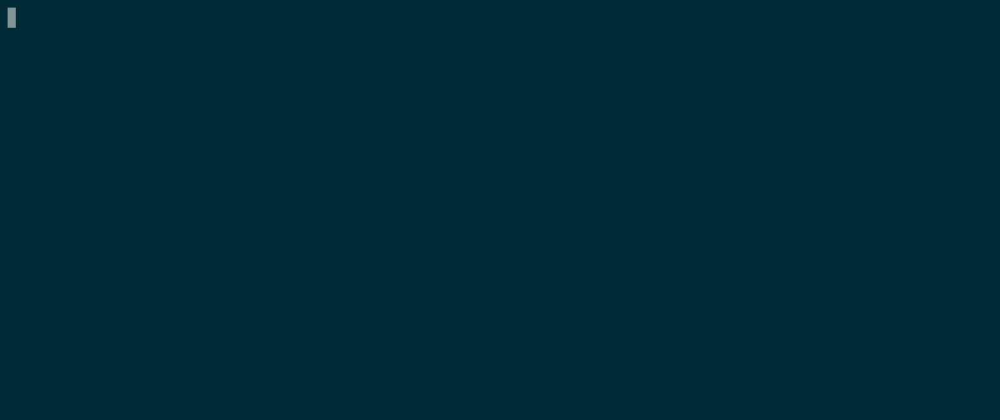

# ganoi

`ganoi` is an implementation in Golang of the Tower of Hanoi.



## The game

The [Tower of Hanoi](https://en.wikipedia.org/wiki/Tower_of_Hanoi) is a mathematical game or puzzle. It consists of three rods and a number of disks of different diameters, which can slide onto any rod. The puzzle starts with the disks stacked on one rod in order of decreasing size, the smallest at the top.

## Recursive Resolution

### Intuition

To move the tower (4, 3, 2, 1) from position `a` to position `c`:

```
    1     |     | 
    2     |     | 
    3     |     | 
    4     |     | 
   ---   ---   ---
    a     b     c
```

You first have to move the tower (3, 2, 1) from position `a` to position `b`.

```
    |     |     | 
    |     1     | 
    |     2     | 
    4     3     | 
   ---   ---   ---
    a     b     c
```

After, you move the last base (4) from position `a` to position `c`.

```
    |     |     | 
    |     1     | 
    |     2     | 
    |     3     4 
   ---   ---   ---
    a     b     c
```

Then move the tower (3, 2, 1) from position `b` to position `c`.

```
    |     |     1 
    |     |     2 
    |     |     3 
    |     |     4 
   ---   ---   ---
    a     b     c
```

### Formalization

For a tower mande of `n` disks, to move this tower from position `a` to position `c`.

1. Move `n-1` stacked disks from `a` to `b`
1. Move `n` th. single disk from `a` to `c`
1. Move `n-1` stacked disks from `b` to `c`

First et last moves can be implemented with the same recursive algorithm.

## Libraries

This program uses the library [termloop](https://github.com/JoelOtter/termloop) to draw the game as a terminal UI.